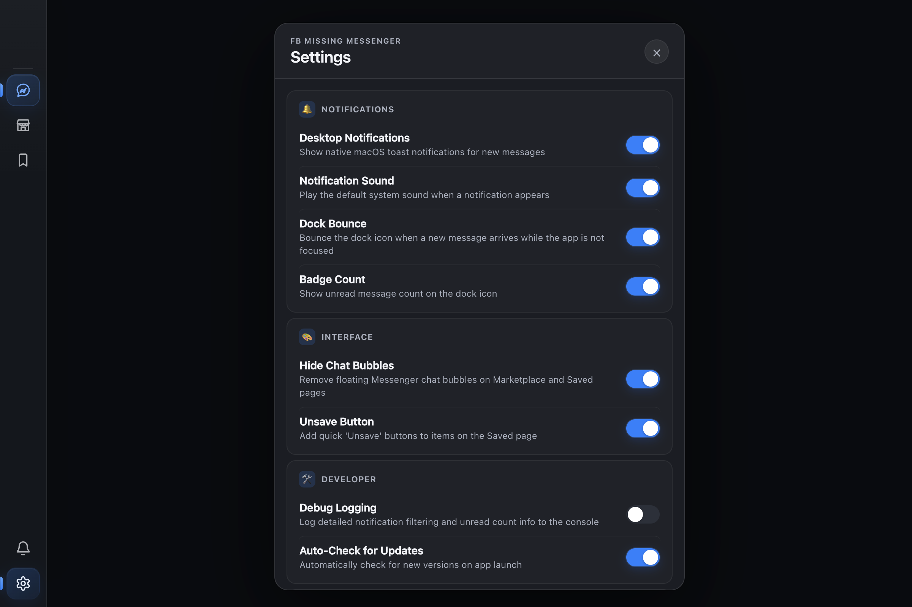

# FB Missing Messenger



A native wrapper for Messenger and Facebook Marketplace, built for macOS.

## Features

- **Native Experience**: Standalone Electron app for Messenger and Facebook with trusted microphone and camera access for calls.
- **Enhanced Sidebar**: Fast navigation between Messenger, Marketplace, Saved items, notification history, and settings.
- **Resilient Conversations**: Exact-chat notification links, offline awareness, automatic tab recovery, and persistent background tabs.
- **Marketplace Power Tools**:
    - **Tab Management**: Opens listings in new sidebar tabs, preventing duplicates.
    - **Clean UI**: Aggressively hides distractions, chat bubbles, and "Marketplace Assistant" popups.
- **Saved Items**:
    - Reliable custom "Unsave" controls and bulk unsaving for loaded sold items.
- **macOS Integration**:
    - Native Notifications for messages.
    - Dock badging for unread counts.
    - Dock bouncing (throttled) for new alerts.

## Tech Stack

- **Electron**: Main process handling and native integration.
- **React**: Renderer UI and component management.
- **TypeScript**: Type-safe development.
- **Vite**: Fast development server and bundling.

## Installation

1. Download the latest `.dmg` from [Releases](https://github.com/lasc/fb-missing-messenger/releases)
2. Open the DMG and drag **FB Missing Messenger** to your Applications folder
3. **Important — macOS Gatekeeper**: Since this app isn't notarized with Apple, macOS will block it on first launch. Run these commands in Terminal to fix it:

   ```bash
   xattr -cr "/Applications/FB Missing Messenger.app"
   codesign --force --deep --sign - "/Applications/FB Missing Messenger.app"
   ```

4. Launch the app from your Applications folder or Dock

> **Note**: You only need to do step 3 once. In-app updates will work without this step.

## Development

### Install Dependencies

```bash
npm install
```

### Run in Development

```bash
npm run dev
```

### Build for Production

This project uses `electron-builder` for distribution.

```bash
npm run dist
```

## License

LGPL-3.0-or-later © 2026 Eugeny Perepelyatnikov
